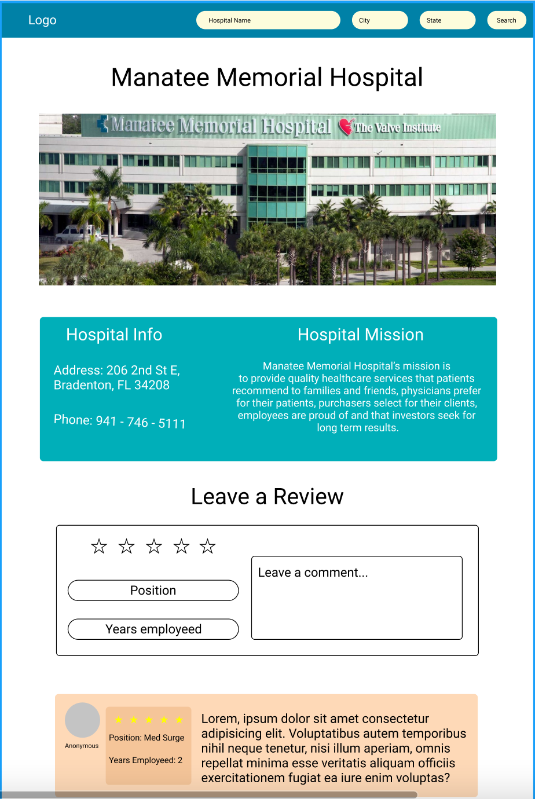

# Project Overview

## Project Name & Link
[HCF-Review](https://hcf-reviews.netlify.app/)


## Project Description

HCF-Review is a website for healthcare professionals to go and write truthful reviews about a healthcare facility they have worked at. A user will be able to search for a healthcare facility. Where they can rate the hospital, Share salary information, or answer other reviewer questions. They can be anonymouse or add their personal information if they would like. If a healthcare facility is not present on the website, the user will be able to add it and then write a review.

## [Flow Chart](https://www.figma.com/file/zM7EESPBBw9cYl2dfRYEHc/Untitled?node-id=0%3A1)



## [Component Hierarchy]()


## API and Data Sample

```
```

### MVP/PostMVP

#### MVP 

- Setup MongoDB database connection
- Create review Schema
- Create User Schema
- Create API endpoints
- Create React App
- Allow user to sign up
- Allow user to Create a review
- Retrieve data from DB
- Display data on page  

#### PostMVP  

- Create user profiles
- Show user reviews on profiles
- Allow users to message other users


## Timeframes

| Component | Priority | Estimated Time | Time Invested |
| --- | :---: |  :---: | :---: |
| Pseudocode | M | 3hrs|  |
| Setting up MongoDB | H | 5hrs|  |
| Create review Schema | L | 1hr |  |
| Create User Schema | L | 1hr|  | 
| Debugging | H | 2hrs|  |
| Create API endpoints | H | 2hrs |  |
| Debugging | H | 2hrs|  |
| Test API endpoints | M | 1hr |  |
| Create React App | L | 1hr| |
| Create User SignUp | M | 3hrs | | 
| Create Review form | M | 3hrs|  | 
| Create front end API calls | H | 2hrs|  |
| Debugging | H | 2hrs|  |
| Display Data on Pages | H | 3hrs|  |
| CSS | H | 10hrs|  |
| Total |  | 41hrs |  |
